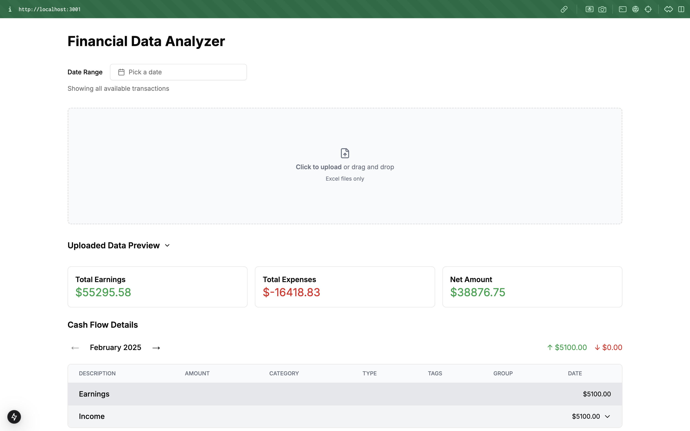

# Financial Data Analyzer



A web application for analyzing financial transactions using AI-powered categorization and visualization.

## Roadmap

- [ ] Remove and edit transactions
- [ ] Model selector
- [ ] DB sync (with supabase)
- [ ] Rag store with raw data for long term memory and categorization improvements
- [ ] Add support for account tagging (where the transactions are coming from)
- [ ] Add support for wealth data import (Stocks, Bonds, Crypto, etc.)
- [ ] More data visualization options (Liftime evolution, net worth evolution, most spent categories, etc.)


## Features

- 📁 Upload Excel/PDF bank statements
- 🤖 AI-powered transaction categorization (OpenAI GPT-4o, Google Gemini)
- 📅 Date range filtering and month navigation
- 📊 Interactive financial summaries and charts
- 🏷️ Automatic transaction tagging and grouping
- 📱 Responsive UI with data tables and previews

## Tech Stack

- **Framework**: Next.js 14 (App Router)
- **Language**: TypeScript
- **State Management**: Jotai
- **UI**: Shadcn/ui + Tailwind CSS
- **AI Integration**: OpenAI API, Google Gemini API
- **Data Processing**: xlsx, pdf-parse
- **Visualization**: React Table, React Charts

## Installation

1. Clone repository:

   ```bash
   git clone https://github.com/gagocarrilloedgar/finance-ai.git
   cd finance-ai
   ```

2. Install dependencies:

   ```bash
   pnpm install
   ```

3. Environment variables (create `.env.local`):

   ```env
   OPENAI_API_KEY=your_openai_key
   GOOGLE_API_KEY=your_google_api_key
   ```

4. Run development server:
   ```bash
   pnpm run dev
   ```

## Usage

1. Upload bank statement (Excel/PDF)
2. View categorized transactions
3. Use date picker to filter by date range
4. Expand/collapse transaction categories
5. Navigate between months using arrow buttons

## Project Structure

```bash
├── app/
│ ├── api/ # API routes
│ │ ├── analyze/ # OpenAI transaction processing
│ │ └── files/ # PDF processing with Gemini
├── components/
│ ├── FileUpload.tsx # Main upload component
│ ├── TransactionList.tsx # Transaction table
│ ├── Providers.tsx # Global state providers
│ ├── ui/ # Shadcn/ui components
│ └── hooks/ # Custom hooks
├── store/
│ └── atoms.ts # Jotai state atoms
└── lib/
└── utils.ts # Utility functions
```

## Key Components

### `components/FileUpload.tsx`

- Handles file upload and processing pipeline
- Manages date range filtering state
- Coordinates data flow between UI and hooks

### `hooks/useFileProcessing.ts`

- Excel/PDF file parsing
- Chunk processing with progress tracking
- AI API integration for transaction analysis

### `hooks/useTransactionProcessing.ts`

- Date range filtering
- Transaction grouping by month
- Data sorting and formatting

### `app/api/analyze/route.ts`

- OpenAI integration for transaction categorization
- Schema validation with Zod
- Response formatting

## License

MIT License
